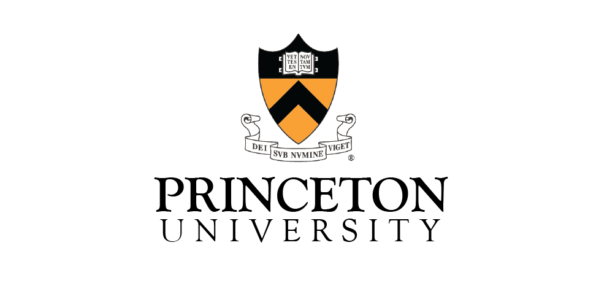

# Algorithms, by Princeton University
Recently I took one of the best, and now also my favourite, course related to algorithms and data structures.
This course is available on Coursera (Part I, Part II) for free until the end of 2020 year. Course is supported by
a book, Algorithms (4th Edition), and book's site where you can find summaries of all chapters and additional material
for practice.

One of the best parts of the course are assignments which are interesting and challenging enough. 
